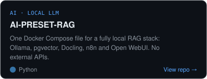

I build AI tooling that takes routine work off QA and development teams — and the test frameworks and pipelines it runs on.

- **AI for QA** — Claude Code agents, subagents and skills wired to issue trackers, design files and the browser through MCP: test scenarios from requirements and PRs, patch analysis, root-cause analysis.
- **CI/CD** — GitHub Actions, GitLab CI and Jenkins pipelines with AI code review, security scanning, health-gated deploys and rollback.
- **Test frameworks** — layered, strictly typed Playwright, Kotlin and TypeScript frameworks, built as reference templates for real teams.

### Featured projects

### Stack

 

 

 

### Contact

